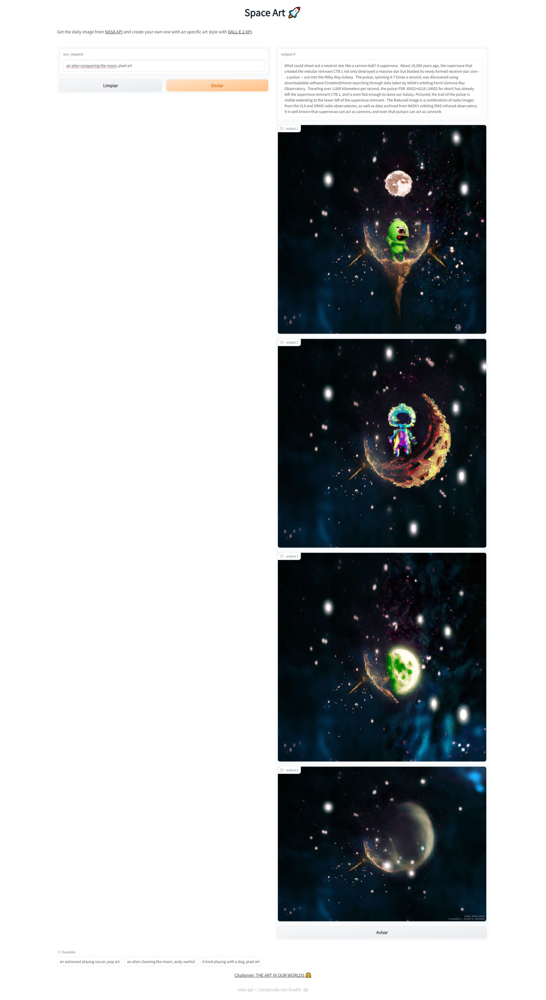
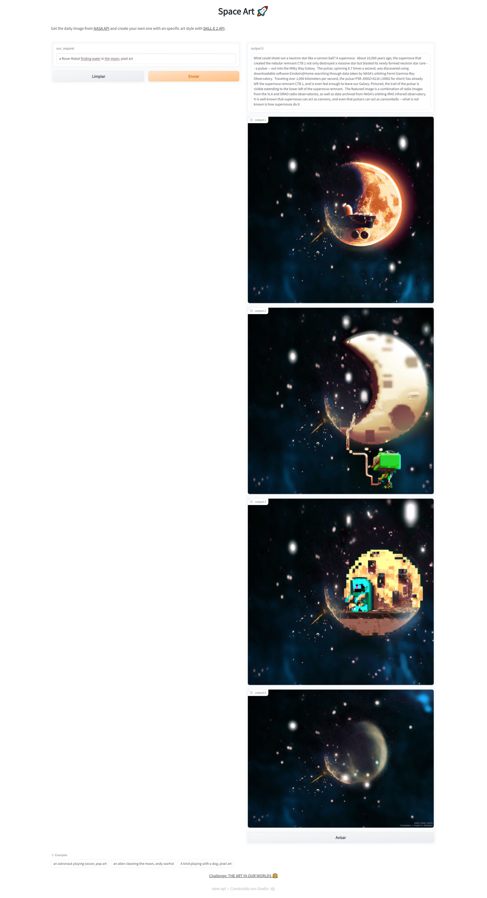

# Space-Art
We are [Space Art](https://2022.spaceappschallenge.org/challenges/2022-challenges/art-worlds/teams/space-art-3/project) from Argentina.

# Technical Requirements

We use:
- Python Language.
- [Gradio](https://www.gradio.app/) for the Graphical User Interface (GUI).

API:
- [DALLE 2 API](https://openai.com/dall-e-2/)
- [NASA: Picture of the day](https://apod.nasa.gov/apod/astropix.html)

Input:
- User prompt text
- Picture of the day from NASA API.

Output:
- Description of Picture of the Day from NASA API.
- 3 images from Picture of the Day with art style from the user text prompt from DallE 2.
- Original Picture of the day

# Examples

